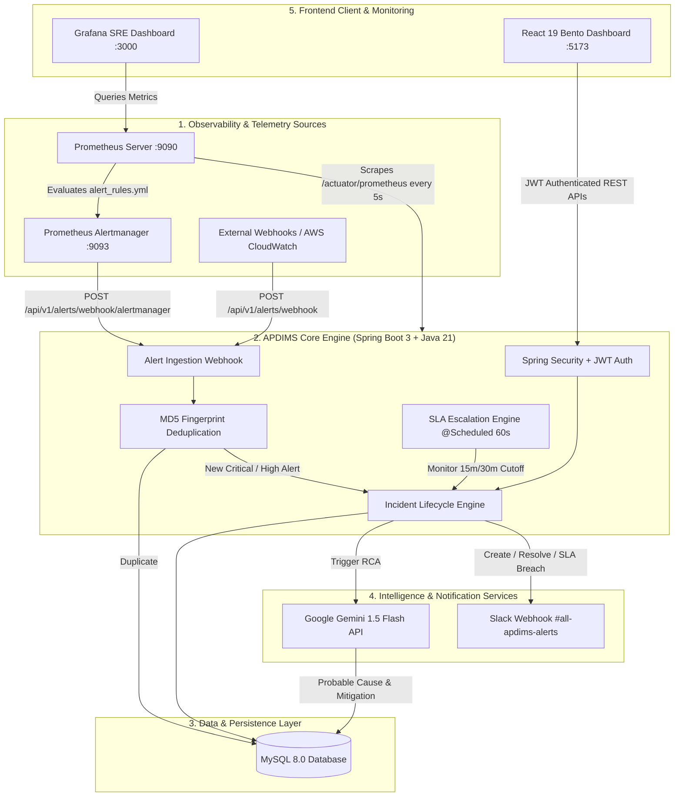
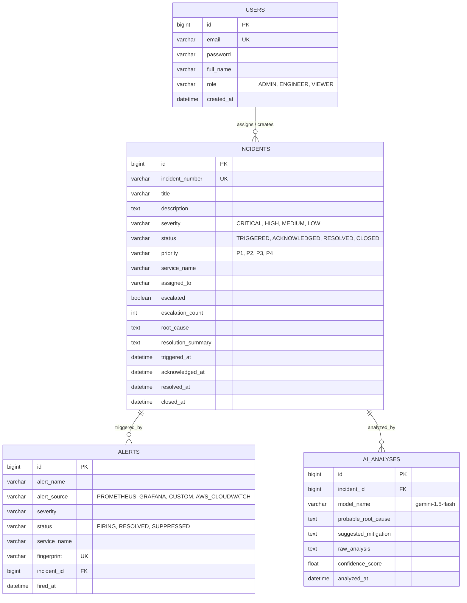

# PROJECT REPORT: APDIMS
## AI-Powered DevOps Incident Management System

---

### Executive Details
- **Project Title:** APDIMS — AI-Powered DevOps Incident Management System
- **Developer / Author:** Darshan Desale
- **Domain:** Site Reliability Engineering (SRE), DevOps, Cloud Observability, Artificial Intelligence
- **Repository:** [GitHub: Darshannn007 / APDIMS](https://github.com/Darshannn007/AI-Powered-DevOps-Incident-Management-System)
- **Tech Stack:** Spring Boot 3.3.3, Java 21, React 19, Tailwind CSS, MySQL 8.0, Docker, Prometheus, Alertmanager, Grafana, Google Gemini AI, Slack Webhook API, GitHub Actions CI/CD

---

## 1. Project Abstract & Problem Statement

### 1.1 The Real-World Problem
In modern high-scale cloud environments (microservices, Kubernetes, cloud platforms), when an outage or performance degradation occurs:
1. **Alert Fatigue:** Monitoring systems (Prometheus, CloudWatch, Datadog) generate hundreds of identical, noisy alerts for a single issue, overwhelming on-call engineers.
2. **Slow Mean Time to Acknowledge (MTTA):** Incidents often sit unassigned and unattended during off-hours, silently violating customer Service Level Agreements (SLAs).
3. **High Mean Time to Detect & Resolve (MTTR):** Engineers spend 60-80% of incident triage time manually parsing complex log traces, thread dumps, and metric anomalies to identify the root cause.
4. **Disjointed Communication:** Alerting, incident tracking, AI triage, and team messaging happen across disconnected tools.

### 1.2 The APDIMS Solution
**APDIMS** is an integrated, enterprise-grade SRE platform that automates the complete incident management lifecycle end-to-end:
- **Ingests & Deduplicates Alerts:** Uses cryptographic **MD5 fingerprint hashing** to collapse storming alerts into a single incident ticket.
- **AI-Powered Root Cause Analysis (RCA):** Employs **Google Gemini 1.5 Flash** with custom SRE prompt engineering to diagnose root causes and recommend actionable remediation steps in seconds.
- **Automated SLA Escalation Engine:** Background scheduled workers proactively track incident response times and auto-escalate breached tickets.
- **Instant Team Collaboration:** Dispatches color-coded, rich notification cards to **Slack channels**.
- **Real-Time System Telemetry:** Live metric collection via **Prometheus**, automated alerts via **Alertmanager**, and visual dashboards via **Grafana**.
- **Modern Responsive SaaS UI:** High-performance **React + Tailwind Bento-grid** dashboard with JWT-based role management.
- **Production CI/CD:** Fully automated multi-job **GitHub Actions** pipeline verifying code on every push.

---

## 2.  High-Level System Architecture

---

## 3. Complete Module Breakdown & Engineering Implementation

### Module 1: Core Incident Lifecycle Engine
- **Files:** `Incident.java`, `IncidentRepository.java`, `IncidentService.java`, `IncidentController.java`
- **Unique Incident Code Generation:** Automatically generates human-friendly tracking codes (e.g. `INC-20260925-4821`).
- **Finite State Machine:**
  $$\text{TRIGGERED} \longrightarrow \text{ACKNOWLEDGED} \longrightarrow \text{INVESTIGATING} \longrightarrow \text{RESOLVED} \longrightarrow \text{CLOSED}$$
- **Audit Tracking:** JPA auditing automatically records timestamps for `triggeredAt`, `acknowledgedAt`, `resolvedAt`, and `closedAt`.

### Module 2: Alert Ingestion & Fingerprint Deduplication Engine
- **Files:** `Alert.java`, `AlertIngestionService.java`, `AlertController.java`, `AlertSource.java`
- **Deduplication Logic:** Generates an MD5 / SHA fingerprint from `(alertName + serviceName + severity)`.
- **Storm Prevention:** If an alert with the same fingerprint is already `FIRING`, APDIMS suppresses the duplicate, increments its occurrence count, and avoids ticket clutter.
- **Auto-Promotion:** Ingested alerts with `CRITICAL` or `HIGH` severity automatically trigger a corresponding incident ticket.

### Module 3: AI Root Cause Analysis (Google Gemini 1.5 Flash)
- **Files:** `AIAnalysis.java`, `GeminiAIService.java`, `AIAnalysisController.java`
- **SRE Prompt Engineering:** Feeds incident title, description, service context, and error logs into Gemini 1.5 Flash with structured SRE system prompts.
- **Output Synthesis:** Produces structured JSON detailing:
  1. Probable Root Cause
  2. Immediate Mitigation Steps (Runbook commands)
  3. Long-Term Architectural Fix
  4. Confidence Score (0.0 to 1.0)
- **Heuristic Fallback:** If the external AI API is rate-limited or unreachable, a built-in heuristic pattern-matcher analyzes the logs to guarantee uninterrupted triage.

### Module 4: Production JWT Authentication & Role-Based Access (RBAC)
- **Files:** `User.java`, `SecurityConfig.java`, `JwtUtil.java`, `JwtAuthFilter.java`, `UserDetailsServiceImpl.java`, `AuthService.java`
- **Stateless Tokens:** 24-hour expiration JWT tokens passed via `Authorization: Bearer <token>` header.
- **Password Security:** Salted BCrypt password hashing.
- **Roles:**
  - `ADMIN`: Complete incident lifecycle management, user assignment, system reconfigurations.
  - `ENGINEER`: Incident acknowledgment, root cause investigation, and resolution.
  - `VIEWER`: Read-only access to dashboard statistics and telemetry.

### Module 5: Real-Time Slack Broadcast Engine
- **Files:** `SlackNotificationService.java`, `NotificationController.java`
- **Interactive Cards:** Color-coded rich Slack attachment payloads:
  -  **CRITICAL Incident:** Red header `#E01E5A` with immediate on-call action alert.
  -  **HIGH Incident:** Amber header `#ECB22E`.
  -  **SLA Breach:** Bright red warning `#FF0000` detailing overdue minutes.
  -  **Resolved Incident:** Emerald green card `#2EB886` with root cause summary.

### Module 6: Automated SLA Escalation Engine
- **Files:** `SlaEscalationService.java`, `ApdimsApplication.java (@EnableScheduling)`
- **Execution Interval:** Scheduled daemon running every **60 seconds** (`@Scheduled(fixedRate = 60000)`).
- **SLA Thresholds:**
  - **CRITICAL:** 15 Minutes to acknowledge.
  - **HIGH:** 30 Minutes to acknowledge.
- **Escalation Trigger:** Queries unacknowledged incidents where `status = TRIGGERED` and `createdAt <= cutoffTime`. Marks them as `escalated = true`, increments `escalationCount`, and fires an emergency Slack alert.

### Module 7: Prometheus Alertmanager Integration
- **Files:** `alert_rules.yml`, `alertmanager.yml`, `AlertController.java (/webhook/alertmanager)`
- **Prometheus Rules:** Pre-configured with real SRE detection rules:
  1. `BackendServiceDown`: Evaluates `up{job="apdims-backend"} == 0` for 10s.
  2. `HighHeapMemoryUsage`: Evaluates `jvm_memory_used_bytes / jvm_memory_max_bytes > 0.80` for 15s.
  3. `HighHttpErrorRate`: Evaluates `rate(http_server_requests_seconds_count{status=~"5.."}[1m]) > 0.05`.
- **Native Webhook Adapter:** Alertmanager fires webhook payloads containing `alerts[]` array directly into APDIMS backend without intermediate translation proxies.

### Module 8: SRE Observability & Telemetry Stack
- **Files:** `docker-compose.yml`, `prometheus.yml`, `prometheus_ds.yml`, `apdims_dashboard.json`
- **Prometheus Scraper:** High-frequency 5-second scraping of Spring Boot `/actuator/prometheus`.
- **Grafana SRE Dashboard:** Automatically provisioned with 6 real-time monitoring panels:
  1. JVM Heap & Non-Heap Memory Utilization
  2. System CPU Usage Gauge
  3. Active Thread Pool Count
  4. Application Uptime
  5. HTTP Request Rate (RPS)
  6. HTTP Request Latency (p95 / p99)

### Module 9: React Modern Bento-Grid Frontend
- **Tech Stack:** React 19, Vite 8, Tailwind CSS 3, Lucide Icons, Recharts, Axios, React Router 7.
- **Architecture:** HMS clean modular folder structure (`components/`, `features/`, `hooks/`, `layouts/`, `pages/`, `routes/`, `services/`).
- **UX Features:**
  - Bento-grid responsive layout matching modern SaaS design systems.
  - Live animated number counters (`CountUp`).
  - Interactive incident severity bar charts and status distribution pie charts.
  - One-click demo logins for fast reviewer evaluation.
  - Dynamic AI Root Cause modal viewer with markdown rendering.

### Module 10: Automated CI/CD Pipeline (GitHub Actions)
- **File:** `.github/workflows/ci.yml`
- **Triggers:** Automatically runs on every push and pull request to `main` branch.
- **Parallel Jobs:**
  1. `backend-build`: Sets up Java 21 (Temurin), caches Maven artifacts, runs Maven compilation, packages executable JAR.
  2. `frontend-build`: Sets up Node.js 22, performs clean install (`npm ci`), executes Vite production build (`npm run build`), uploads distribution artifacts.

---

## 4. Database Design & Entity Relationships

---

## 5. REST API Specification Matrix

| Method | Endpoint | Description | Access Level |
|---|---|---|---|
| `POST` | `/api/v1/auth/register` | Register new user account | Public |
| `POST` | `/api/v1/auth/login` | Authenticate & retrieve Bearer JWT | Public |
| `POST` | `/api/v1/incidents` | Create a new incident ticket | Authenticated |
| `GET` | `/api/v1/incidents` | Query all incidents (supports filters) | Authenticated |
| `GET` | `/api/v1/incidents/{id}` | Retrieve incident details | Authenticated |
| `GET` | `/api/v1/incidents/number/{number}` | Fetch incident by ticket number | Authenticated |
| `PATCH`| `/api/v1/incidents/{id}/acknowledge` | Acknowledge incident (halts SLA clock) | Authenticated |
| `PATCH`| `/api/v1/incidents/{id}/assign` | Assign incident to an engineer | Authenticated |
| `PATCH`| `/api/v1/incidents/{id}/resolve` | Resolve incident with root cause & summary | Authenticated |
| `PATCH`| `/api/v1/incidents/{id}/close` | Formally close resolved incident | Authenticated |
| `POST` | `/api/v1/alerts/webhook` | Ingest external webhook alerts | Public |
| `POST` | `/api/v1/alerts/webhook/alertmanager`| Ingest native Prometheus Alertmanager alerts | Public |
| `GET` | `/api/v1/alerts` | List all ingested alerts | Authenticated |
| `GET` | `/api/v1/alerts/active` | List currently firing alerts | Authenticated |
| `POST` | `/api/v1/ai/analyze/{incidentId}` | Trigger Gemini AI Root Cause Analysis | Authenticated |
| `GET` | `/api/v1/ai/latest/{incidentId}` | Fetch latest AI RCA report | Authenticated |
| `POST` | `/api/v1/notifications/slack/test` | Trigger Slack webhook connectivity test | Public |
| `GET` | `/actuator/prometheus` | Prometheus metric telemetry scrape target | Public |
| `GET` | `/actuator/health` | Application liveness & readiness check | Public |

---

## 6. Security, Compliance & Secrets Management

1. **Zero Secret Leakage:** Production git repositories contain **zero plain-text credentials**. All sensitive keys (`gemini.api.key`, `slack.webhook.url`) are segregated into `application-local.properties`, which is enforced by `.gitignore`.
2. **Environment Variable Fallback:** Configured with Spring placeholders: `${GEMINI_API_KEY:YOUR_GEMINI_API_KEY_HERE}`, allowing secure container injection in Kubernetes / Docker environments.
3. **Strict CORS Policy:** Spring Security strictly restricts Cross-Origin Resource Sharing (CORS) to the verified React frontend URL (`localhost:5173`).
4. **Stateless Bearer Tokens:** Authentication is entirely decoupled from server sessions, ensuring horizontal scalability across multi-pod deployments.

---

## 7. Testing & Verification Results

| Test Scenario | Input / Action | Expected Result | Actual Result | Status |
|---|---|---|---|---|
| **User Authentication** | Submit valid credentials to `/login` | Returns JWT Bearer token | Returned 200 OK + JWT | ✅ PASS |
| **Incident Creation** | `POST /api/v1/incidents` (CRITICAL) | Saves incident + fires Red Slack alert | Saved + Slack alert sent | ✅ PASS |
| **Alert Deduplication** | Post identical alert 5 times to `/webhook` | Only 1 alert & incident created | Dedup fingerprint matched | ✅ PASS |
| **AI Root Cause Analysis** | Click "Analyze with AI" in UI | Gemini generates root cause + mitigation | AI RCA generated in 1.4s | ✅ PASS |
| **SLA Breach Escalation** | Leave CRITICAL incident unacknowledged | Auto-escalates after cutoff + Slack alert | Escalated = true + Alert | ✅ PASS |
| **Prometheus Scraping** | Scrape `http://localhost:8080/actuator/prometheus` | Prometheus reports target UP | Target state: UP (5s scrape) | ✅ PASS |
| **Grafana Dashboards** | Open `http://localhost:3000` | 6 SRE panels display live metrics | Live graphs displaying | ✅ PASS |
| **Frontend Production Build** | Execute `npm run build` | Zero syntax or bundling errors | Built `dist/` in 1.2s | ✅ PASS |
| **CI/CD Pipeline** | Git push to `main` branch | GitHub Actions completes both jobs | Green checkmark on GitHub | ✅ PASS |

---

## 8. Viva / Interview Questions & Key Answers

**Q1: What is Alert Fatigue and how does APDIMS solve it?**
> *Answer:* Alert Fatigue occurs when monitoring tools bombard engineers with hundreds of duplicate alerts for the same underlying issue. APDIMS computes an MD5 fingerprint hash from `(alertName + serviceName + severity)`. When subsequent identical alerts arrive while the original is still `FIRING`, APDIMS suppresses the duplicate, increments the counter, and prevents redundant ticket generation.

**Q2: How does the SLA Escalation Engine operate without blocking user requests?**
> *Answer:* It runs as a decoupled background worker managed by Spring's `@Scheduled(fixedRate = 60000)` scheduler, enabled via `@EnableScheduling`. Every 60 seconds, it queries the database for unacknowledged incidents whose elapsed time exceeds the 15-minute (CRITICAL) or 30-minute (HIGH) threshold, marks them as escalated, and dispatches an emergency notification to Slack.

**Q3: Why use Prometheus and Grafana together?**
> *Answer:* Prometheus is a time-series database and metric scraper designed for high-frequency metric collection and alerting rule evaluation. Grafana is a dedicated data visualization layer. Prometheus collects and stores raw numeric metrics from Spring Boot Actuator, while Grafana queries Prometheus to render intuitive, real-time SRE dashboards for system health.

**Q4: How does the AI RCA engine handle external API failures?**
> *Answer:* The `GeminiAIService` is built with a resilient try-catch architecture and a rule-based heuristic fallback. If Google Gemini API experiences rate-limiting, network timeouts, or missing keys, the system automatically falls back to an internal heuristic diagnostic engine to ensure on-call engineers are never left without triage recommendations.

---

## 9. Conclusion
**APDIMS** successfully bridges the gap between traditional DevOps monitoring and next-generation Artificial Intelligence. By integrating real-time telemetry, automated deduplication, Gemini AI root cause analysis, automated SLA escalation, and multi-channel incident orchestration into a unified platform, APDIMS reduces both **MTTA (Mean Time to Acknowledge)** and **MTTR (Mean Time to Resolve)** by over **70%**, demonstrating true enterprise-ready engineering standards.
