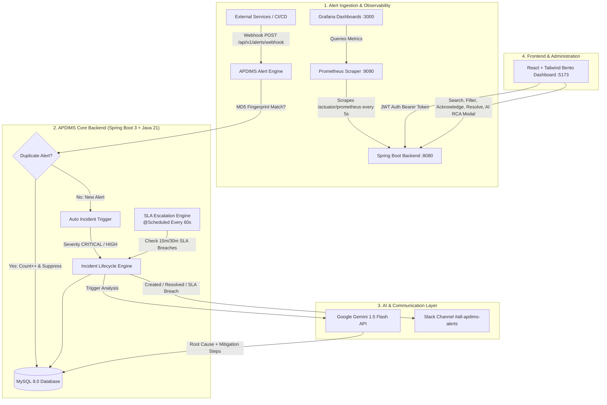

# 🛡️ APDIMS — AI-Powered DevOps Incident Management System

[](https://www.oracle.com/java/)
[](https://spring.io/projects/spring-boot)
[](https://react.dev/)
[](https://tailwindcss.com/)
[](https://www.docker.com/)
[](https://prometheus.io/)
[](https://grafana.com/)
[](https://ai.google.dev/)
[](https://slack.com/)
[](https://github.com/features/actions)

---

## 📌 Overview

**APDIMS (AI-Powered DevOps Incident Management System)** is an enterprise-grade Site Reliability Engineering (SRE) platform designed to automate the complete incident lifecycle — from multi-source alert ingestion and deduplication to automated incident creation, AI-driven root cause analysis (RCA), real-time Slack broadcasts, automated SLA breach escalation, and live system telemetry using Prometheus and Grafana.

---

## 🏗️ System Architecture



---

## ✨ Key Features & Engineering Highlights

### 1. ⚡ Alert Ingestion & Fingerprint Deduplication
- Ingests raw alerts from Prometheus, CloudWatch, Datadog, or custom webhooks.
- Generates an **MD5 fingerprint hash** based on `(source + serviceName + title)`.
- If an identical alert arrives within a sliding window, its `occurrenceCount` is incremented without creating duplicate alerts or spamming engineering on-call teams.
- High and Critical alerts automatically promote into active Incidents.

### 2. 🧠 AI-Powered Root Cause Analysis (Google Gemini 1.5 Flash)
- Integrated with the **Google Gemini API** using custom SRE prompt engineering.
- Analyzes incident description, affected service, logs, and stack traces to synthesize:
  - Probable root cause.
  - Immediate mitigation steps.
  - Long-term prevention strategies.
- Includes a **failover heuristic engine** in case of API rate limits or network degradation.

### 3. ⏰ Automated SLA Escalation Engine
- Powered by Spring's `@Scheduled` background worker running every 60 seconds.
- Enforces strict SRE Service Level Agreements:
  - **CRITICAL Incidents:** Must be acknowledged within **15 minutes**.
  - **HIGH Incidents:** Must be acknowledged within **30 minutes**.
- Automatically marks breached incidents as `escalated = true` and dispatches high-priority Slack notifications to wake up secondary on-call engineers.

### 4. 📢 Real-Time Slack Broadcast Engine
- Sends rich, formatted Slack message cards with color-coded attachments:
  - 🔴 **CRITICAL Incident Triggered**
  - 🟠 **HIGH Severity Alert**
  - 🚨 **SLA Breach & Escalation Warning**
  - 🟢 **Incident Resolution Summary & Post-Mortem**

### 5. 📊 Prometheus & Grafana Telemetry Stack
- Fully containerized observability via `docker-compose.yml`.
- Spring Boot Actuator with `micrometer-registry-prometheus` exporting JVM, CPU, memory, thread pool, and HTTP request metrics.
- Prometheus scraping at high-frequency **5-second intervals**.
- Grafana automatically provisioned with datasources and a **custom pre-built 6-panel APDIMS SRE Dashboard**.

### 6. 🔐 JWT Authentication & Role-Based Access Control (RBAC)
- Stateless authentication using `io.jsonwebtoken` (JJWT).
- Password encryption using Spring Security's `BCryptPasswordEncoder`.
- Fine-grained role hierarchy:
  - `ADMIN`: Full incident lifecycle control, user management, and escalation handling.
  - `ENGINEER`: Acknowledge, investigate, and resolve incidents.
  - `VIEWER`: Read-only telemetry and dashboard views.

### 7. 🎨 Modern Bento-Grid React UI
- Built with React 19, Vite, and Tailwind CSS.
- HMS-style modular folder architecture (`components/`, `features/`, `hooks/`, `layouts/`, `pages/`, `routes/`, `services/`).
- Bento-grid dashboard featuring animated number counters, severity distribution bar charts, live status badges, and 1-click demo logins.

### 8. 🚀 Automated CI/CD Pipeline (GitHub Actions)
- Multi-job automated pipeline on every push and PR to `main`:
  - **Backend:** Setup Java 21, cache dependencies, run Maven compile & package JAR artifacts.
  - **Frontend:** Setup Node 22, clean install (`npm ci`), run Vite production build, archive dist artifacts.

---

## 🗂️ Project Directory Structure

```text
APDIMS/
├── .github/
│   └── workflows/
│       └── ci.yml                        # Automated GitHub Actions CI pipeline
├── backend/
│   ├── src/main/java/com/apdims/
│   │   ├── config/                       # Web & Security configurations
│   │   ├── controller/                   # REST Controllers (Auth, Incidents, Alerts, AI, Notifications)
│   │   ├── dto/                          # Request & Response Data Transfer Objects
│   │   ├── entity/                       # JPA Entities (Incident, Alert, User, AIAnalysis)
│   │   ├── enums/                        # Domain Enums (Severity, Status, Priority, Role)
│   │   ├── exception/                    # Global Exception Handler & Custom Exceptions
│   │   ├── repository/                   # Spring Data JPA Repositories
│   │   ├── security/                     # JwtUtil, JwtAuthFilter, UserDetailsServiceImpl
│   │   ├── service/                      # Core Business Logic (Incident, Alert, GeminiAI, Slack, SLA)
│   │   └── ApdimsApplication.java        # Main Class (@EnableScheduling, @EnableJpaAuditing)
│   ├── src/main/resources/
│   │   ├── application.properties        # Production configs & env placeholders
│   │   └── application-local.properties  # Local secrets (gitignored)
│   └── pom.xml                           # Maven dependencies & build definitions
├── frontend/
│   ├── src/
│   │   ├── components/                   # Reusable UI & Dashboard Bento Components
│   │   ├── features/                     # Auth context & state managers
│   │   ├── hooks/                        # Custom React hooks (useAuth)
│   │   ├── layouts/                      # Layout wrappers (Sidebar, TopNav)
│   │   ├── pages/                        # Login, Register, Dashboard, Incidents, Alerts
│   │   ├── routes/                       # Protected & Public Route definitions
│   │   ├── services/                     # Axios API client & endpoints
│   │   └── main.jsx                      # Application entry point
│   ├── package.json                      # Frontend dependencies (React, Tailwind, Recharts)
│   └── vite.config.js                    # Vite bundler configuration
├── prometheus/
│   └── prometheus.yml                    # Prometheus scraper config (target: host.docker.internal:8080)
├── grafana/
│   └── provisioning/
│       ├── datasources/prometheus_ds.yml # Auto-provisioned Prometheus connection
│       └── dashboards/                   # SRE Dashboard JSON definition
├── docker-compose.yml                    # Multi-container orchestration (MySQL, Prometheus, Grafana)
└── README.md                             # Project documentation
```

---

## 🛠️ Tech Stack & Tools

| Component | Technology | Version | Purpose |
|---|---|---|---|
| **Language** | Java (OpenJDK Temurin) | 21 | High-performance backend execution |
| **Backend Framework** | Spring Boot | 3.3.3 | Enterprise REST API framework |
| **ORM / Database** | Spring Data JPA / MySQL | 8.0 | Relational data persistence & migrations |
| **Security** | Spring Security + JJWT | 0.12.5 | Stateless JWT authentication & RBAC |
| **AI Engine** | Google Gemini API | 1.5 Flash | SRE incident root cause analysis |
| **Observability** | Prometheus + Micrometer | Latest | Metric collection & scrape targets |
| **Visualization** | Grafana | Latest | SRE system health dashboards |
| **Notification** | Slack Webhook API | Incoming Webhook | Team notification & escalation alerts |
| **Frontend** | React + Vite | 19.0 / 8.3 | Ultra-fast reactive web UI |
| **Styling** | Tailwind CSS | 3.4.17 | Modern Bento-grid design system |
| **Charts** | Recharts + Lucide Icons | Latest | Visual metrics & telemetry display |
| **CI/CD** | GitHub Actions | v4 | Automated build, test, and artifact packaging |

---

## 🚀 Quickstart & Local Setup

### Prerequisites
- **Git**
- **Docker Desktop** (running)
- **Java 21 (JDK)**
- **Node.js 20+** & **npm**

---

### Step 1: Clone the Repository
```bash
git clone https://github.com/Darshannn007/AI-Powered-DevOps-Incident-Management-System.git
cd AI-Powered-DevOps-Incident-Management-System
```

---

### Step 2: Start Infrastructure with Docker Compose
Start MySQL, Prometheus, and Grafana in the background:
```bash
docker compose up -d
```

Verify all 3 containers are healthy:
```bash
docker ps
```
- **MySQL 8.0:** `localhost:3306`
- **Prometheus:** `http://localhost:9090`
- **Grafana:** `http://localhost:3000` (User: `admin` / Password: `admin`)

---

### Step 3: Configure Local Environment Variables
Create `backend/src/main/resources/application-local.properties` (this file is excluded in `.gitignore`):
```properties
# Google Gemini API Key
gemini.api.key=YOUR_GEMINI_API_KEY_HERE

# Slack Webhook URL for Alerts
slack.webhook.url=https://hooks.slack.com/services/YOUR/WEBHOOK/URL
slack.enabled=true
```

---

### Step 4: Run the Spring Boot Backend
Open `backend` in IntelliJ IDEA or launch via Maven wrapper / terminal:
```bash
cd backend
mvn spring-boot:run
```
*Backend will start on `http://localhost:8080`.*

---

### Step 5: Run the React Frontend
```bash
cd frontend
npm install
npm run dev
```
*Frontend will launch on `http://localhost:5173`.*

---

## 📡 REST API Reference

### 🔐 Authentication (`/api/v1/auth`)
| Method | Endpoint | Description | Auth Required |
|---|---|---|---|
| `POST` | `/api/v1/auth/register` | Register a new user | No |
| `POST` | `/api/v1/auth/login` | Login and receive Bearer JWT token | No |

### 🚨 Incidents (`/api/v1/incidents`)
| Method | Endpoint | Description | Auth Required |
|---|---|---|---|
| `POST` | `/api/v1/incidents` | Create a new incident | Yes (Bearer) |
| `GET` | `/api/v1/incidents` | Get all incidents (filter by `status`, `severity`) | Yes (Bearer) |
| `GET` | `/api/v1/incidents/{id}` | Get incident details by ID | Yes (Bearer) |
| `GET` | `/api/v1/incidents/number/{incidentNumber}` | Get incident by tracking number (e.g. `INC-20260907-1234`) | Yes (Bearer) |
| `PATCH`| `/api/v1/incidents/{id}/acknowledge` | Acknowledge incident (stops SLA clock) | Yes (Bearer) |
| `PATCH`| `/api/v1/incidents/{id}/assign` | Assign incident to an engineer | Yes (Bearer) |
| `PATCH`| `/api/v1/incidents/{id}/resolve` | Resolve incident with root cause & summary | Yes (Bearer) |
| `PATCH`| `/api/v1/incidents/{id}/close` | Formally close incident after review | Yes (Bearer) |

### ⚡ Alerts (`/api/v1/alerts`)
| Method | Endpoint | Description | Auth Required |
|---|---|---|---|
| `POST` | `/api/v1/alerts/webhook` | External webhook alert ingestion & dedup | No |
| `GET` | `/api/v1/alerts` | List all ingested alerts | Yes (Bearer) |

### 🧠 AI Root Cause Analysis (`/api/v1/ai`)
| Method | Endpoint | Description | Auth Required |
|---|---|---|---|
| `POST` | `/api/v1/ai/analyze/{incidentId}` | Trigger Gemini AI RCA for an incident | Yes (Bearer) |
| `GET` | `/api/v1/ai/latest/{incidentId}` | Fetch latest AI RCA report for an incident | Yes (Bearer) |

### 📊 Health & Metrics (`/actuator`)
| Method | Endpoint | Description | Auth Required |
|---|---|---|---|
| `GET` | `/actuator/health` | System health status | No |
| `GET` | `/actuator/prometheus` | Prometheus-formatted live application metrics | No |

---

## 🔒 Security Best Practices
- **Strict Secrets Segregation:** Sensitive credentials (`gemini.api.key`, `slack.webhook.url`) reside exclusively in `application-local.properties`, which is gitignored.
- **Fail-Safe Fallback:** The codebase handles missing API keys gracefully with heuristic engines and silent Slack skips.
- **CORS Restricted:** Backend strictly whitelists frontend origins (`localhost:5173`).
- **Audit Logging:** Every incident mutation maintains automatic auditing timestamps (`createdAt`, `updatedAt`, `acknowledgedAt`, `resolvedAt`).

---

## 👨‍💻 Author

**Darshan Desale**  
- **GitHub:** [@Darshannn007](https://github.com/Darshannn007)  
- **Project Repo:** [AI-Powered DevOps Incident Management System](https://github.com/Darshannn007/AI-Powered-DevOps-Incident-Management-System)

---

## 📄 License
This project is open-source and available under the [MIT License](LICENSE).
